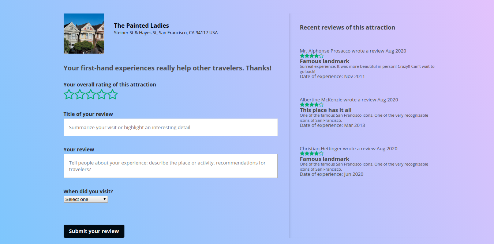

# TravelGuide README
[Live site](http://trippyaide.herokuapp.com/)
## Summary
TrippyAide is a travel planning app inspired by the travel site [TripAdvisor](https://tripadvisor.com).   
TrippyAide allows users to browse through attractions and hotels at the city they are interested in and read
the reviews other users have left to plan their own trips.  
## Structure
### Backend
TrippyAide is built using Ruby on Rails with a PostgreSQL database on the backend. All internal data APIs 
use AJAX and parse data as JSON using JBuilder. Images are hosted on AWS S3.
### Frontend
TrippyAide is a single page app built using React and Redux. It also uses the Google Maps API.
### Libraries
TrippyAide uses:  
* [React.js](https://reactjs.org/)
* [Redux](https://redux.js.org/)
* [BCrypt](https://github.com/codahale/bcrypt-ruby) for authorization
* [Figaro](https://github.com/laserlemon/figaro) to store API keys
* [Faker](https://github.com/faker-ruby/faker) to generate data
* [Google Maps](https://developers.google.com/maps/documentation) to display maps
## Features

### Dynamic Map
The dynamic map updates its markers everytime the map view is changed.
```javascript
this.map = new google.maps.Map(this.mapNode, mapOptions);
this.MarkerManager = new MarkerManager(this.map, 'dynamic');
let that = this;
google.maps.event.addListener(this.map, 'idle', () => {
  const LatLngBounds = this.map.getBounds();
  const northEast = LatLngBounds.getNorthEast();
  const southWest = LatLngBounds.getSouthWest();
  const bounds = {
    northEast: { lat: northEast.lat(), lng: northEast.lng() },
    southWest: { lat: southWest.lat(), lng: southWest.lng() }
  };
  that.props.updateMapFilter("bounds", bounds);
});
```
### Custom Marker Information Windows
The custom marker information windows are designed by extending Google Maps OverlayView.

### Attraction Reviews

Allows users to leave their reviews on attractions if they are logged in. Also shows the most recent reviews of the attraction.   
When rating the attraction, the stars will change as they get hovered or clicked on, designed with each individual star having event listeners and utilizing React's local state.  
```JSX
getStar(number) {
  const starclass = (this.state.hover_rating !== 0) ? 
    (this.state.hover_rating >= number) ? 
        "fa fa-star selectable" : 
        "fa fa-star-o selectable"
    : (this.state.rating >= number) ? 
        "fa fa-star selectable" :
        "fa fa-star-o selectable"
  const star = <span 
                  onMouseEnter={() => this.setHoverStars(number)}
                  onMouseLeave={() => this.setHoverStars(0)}
                  onMouseDown={() => this.setStars(number)} 
                  className={starclass}
                  ></span>;
  return star;
}
getStars() {
  return (
    <div>
      {this.getStar(1)}
      {this.getStar(2)}
      {this.getStar(3)}
      {this.getStar(4)}
      {this.getStar(5)}
    </div>
  )
}
```

## Next steps for development
I plan on continuing to develop TrippyAide. Some possible features include:
**Integration of Yelp API for restaurants**   
**Image uploading**   
* This one not might be possible because of AWS storage cost
**A plan trip feature that allows you to plan and map a route**   

